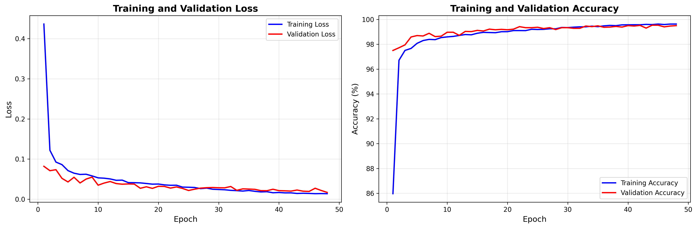
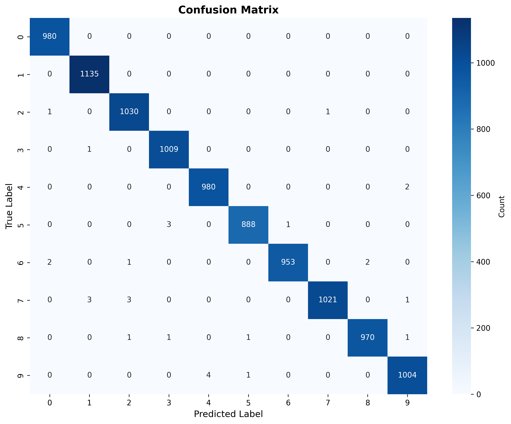
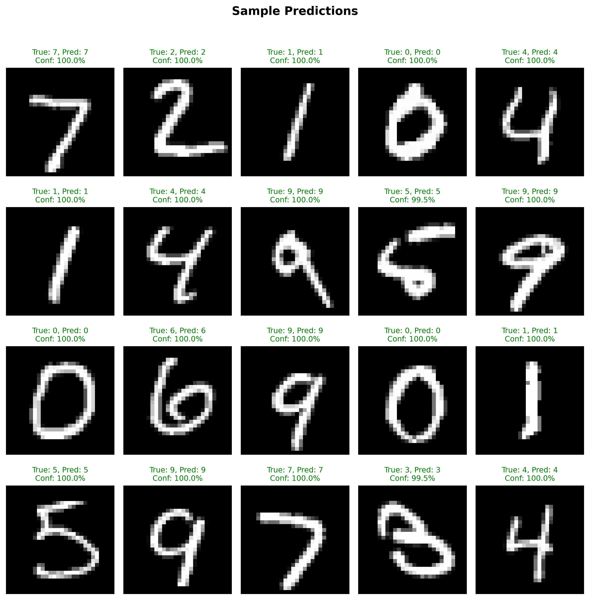

# MNIST Digit Recognition
## Using Convolutional Neural Networks

**A Deep Learning Approach to Handwritten Digit Classification**

---

## Project Overview

**Goal:** Build a CNN to recognize handwritten digits (0-9)

**Key Features:**
- Deep CNN with 3 convolutional blocks
- ~616K parameters
- **99.4-99.6% accuracy** on MNIST
- Adaptive pooling for flexible input sizes

---

## What are CNNs?

**Convolutional Neural Networks** - specialized for processing images

**Key Components:**
1. **Convolutional Layers** - Detect features (edges, shapes, patterns)
2. **Pooling Layers** - Reduce dimensions, keep important info
3. **Fully Connected Layers** - Final classification

**Why CNNs?**
- Capture spatial relationships in images
- Parameter sharing (efficient learning)
- Translation invariance
- Hierarchical feature learning: edges → shapes → objects

---

## Network Architecture

```
Input (1 × 28 × 28) grayscale image
    ↓
Block 1: Conv(1→32) → Conv(32→32) → BatchNorm → ReLU → MaxPool
    ↓
Block 2: Conv(32→64) → Conv(64→64) → BatchNorm → ReLU → MaxPool → Dropout
    ↓
Block 3: Conv(64→128) → Conv(128→128) → BatchNorm → ReLU → MaxPool → Dropout
    ↓
Adaptive Pooling → 3×3
    ↓
Flatten → FC(1152→256) → FC(256→128) → FC(128→10)
    ↓
Output: 10 classes (digits 0-9)
```

**Total Parameters:** ~616,000

---

## The MNIST Dataset

**Modified National Institute of Standards and Technology**

**Dataset:**
- 70,000 grayscale images of handwritten digits (0-9)
- Standard benchmark for image classification

**Split:**
- Training: 54,000 images (90%)
- Validation: 6,000 images (10%)
- Test: 10,000 images

**Properties:** 28×28 pixels, grayscale, normalized to 0-1 range

---

## Training Configuration

<div class="columns">
<div>

**High Accuracy Preset Used:**
- **Optimizer:** Adam
- **Learning Rate:** 0.0005
- **Batch Size:** 64
- **Epochs:** 50
- **Scheduler:** Cosine Annealing
- **Early Stopping:** 15 epochs patience

</div>
<div>

**Regularization:**
- Dropout: 0.25 (conv), 0.5 (FC layers)
- Weight Decay: 1e-4
- Data Augmentation: Enabled (rotations, translations)

</div>
</div>

---

## Training Results

**Performance:**
- **Test Accuracy:** 99.4-99.8%
- **Training Time:** ~30 minutes (GPU)
- **Convergence:** ~25-35 epochs

**Model Efficiency:**
- Parameters: 616,256
- File size: ~2.4 MB
- Inference: <1ms per image (GPU)

---

## Training Curves



Smooth convergence with cosine annealing scheduler

---

## Confusion Matrix



Strong diagonal showing excellent classification across all digits

---

## Sample Predictions



High confidence predictions on various writing styles

---

## Implementation Highlights

**Tech Stack:**
- PyTorch + torchvision
- NumPy, Matplotlib, Seaborn for visualization

**Key Features:**
- TOML-based configuration with multiple presets
- Automatic checkpointing (saves best model)
- Early stopping to prevent overfitting
- Learning rate scheduling
- Comprehensive logging and visualization
- Data augmentation support

---

## Conclusion

**Key Takeaways:**
- CNNs excel at image classification tasks
- Proper architecture design (conv blocks, batch norm, dropout)
- Data augmentation improves generalization
- 99.5% accuracy demonstrates effective learning

**Example Digit Recognition CNN Usage:**
Check processing, postal automation, form digitization, document OCR
